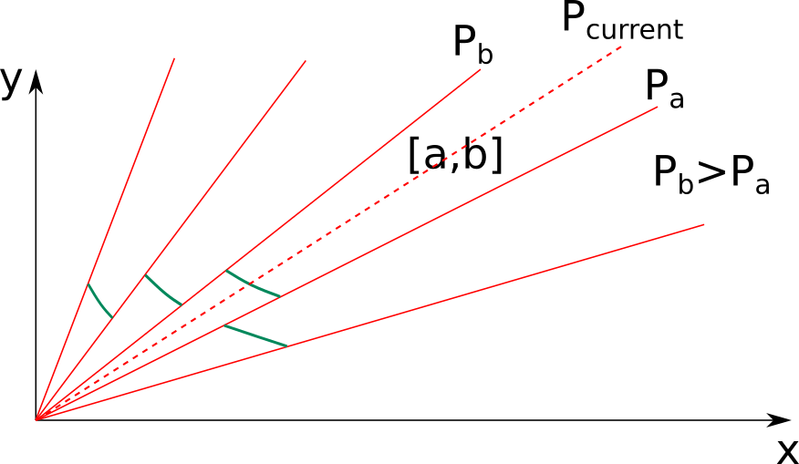
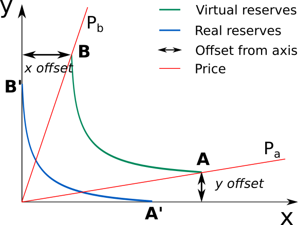

# UniswapV3

Features:

- Concentrated Liquidity
- Improved Price Oracle
- Flexible Fees

## Uniswap V2 IL

Market with Liquidity $L$ and Asset $X$ and $Y$ with amounts $x$ and $y$ respectively.
$$x*y = L^2$$
Initial Price $P$ of asset $X$ in terms of $Y$ = $y/x$, with price movement from $P$ to $P' = Pk$.
Then,
$$x = \frac{L}{\sqrt{P}}$$
$$y = L\sqrt{P}$$

We, introduce three terms

- $V_0$, value of initial holdings in terms of Y
- $V_1$, value when kept in pool
- $V_{held}$, value when held

$$V_0 = y*1 + x*P = 2L\sqrt{P}$$
$$V_1 = 2L\sqrt{P'} = 2L\sqrt{Pk}$$
$$V_{held} = y + xP' = L\sqrt{P}(1+k)$$
$$IL(k) = \frac{V_1 - V_{held}}{V_{held}} = \frac{L\sqrt{P}(2\sqrt{k} - 1 - k)}{L\sqrt{P}(1 + k)} = \frac{2\sqrt{k}}{1+k} - 1$$

## Uniswap V3 Pool Maths

Uniswap V3 pools are different from V2 as the liquidity is not uniformly distributed from $0$ to $\infty$, but each position functions as a separate CFMM curve.



For an $xy=k$ curve, let $P_a$ and $P_b$ be the price range in which liquidity is deployed, then Real Reserves:

$$(x + x_{offset})(y + y_{offset}) = L^2$$

where, $x_{offset}$ and $y_{offset}$ is the point A and B at which lines $x=ky$ touch the liquidity curve. $P_b$ > $P_a$, i.e. steeper the slope more is the price. Since, liquidity outside this position is irrelevant, the real reserves are obtained shifting the curve by the offsets.



Equation of Real Reserves becomes:
$$(x + x_{offset})(y + y_{offset}) = L^2$$
$$(x + \frac{L}{\sqrt{P_b}})(y + L\sqrt{P_a}) = L^2$$

This can be divided into three parts:

1. Current Price, $P <= P_a$

When price < $P_a$, all of the liquidity is in asset X, then

$$(x + \frac{L}{\sqrt{P_b}})L\sqrt{P_a} = L^2$$
$$x = L\frac{\sqrt{P_b} - \sqrt{P_a}}{\sqrt{P_a}\sqrt{P_b}}$$

2. $P >= P_b$

When price > $P_b$, all of the liquidity is in asset Y, then

$$y = L(\sqrt{P_b} - \sqrt{P_a})$$

3. $P_a < P < P_b$

Assume that the price moves from P_a to P, then the amount of asset Y contributing to liquidity should be equal to amount of asset X contributing to liquidity when moving from P_b to P.

$$L_x (P_b, P) = L_y(P, P_a)$$
$$x\frac{\sqrt{P}\sqrt{P_b}}{\sqrt{P_b} - \sqrt{P}} = \frac{y}{\sqrt{P} - \sqrt{P_a}}$$
$$x = L\frac{\sqrt{P_b} - \sqrt{P}}{\sqrt{P}\sqrt{P_b}}$$
$$y = L(\sqrt{P} - \sqrt{P_a})$$

## Core

Uniswap's Core contracts functionality can be divided into three main components:

1. Price and Liquidity
2. TWAP Oracle
3. Fees

Main building blocks for these functionality is through `ticks` and `positions`.

### Ticks

A tick in terms of price is represented as:
$$i_c = \lfloor{\log_{\sqrt{1.001}}\sqrt{P}}\rfloor$$

In Uniswap V2, price space was continuous as the liquidity was divided across the whole space i.e. $[0, \infty]$. V3 introduced the concept of concentrated liquidity in the form of ticks i.e. now, the price is divided discretely such that 1 tick represents 1 basis points (0.01% price change).

```solidity
// info stored for each initialized individual tick
struct Info {
    // the total position liquidity that references this tick
    uint128 liquidityGross;
    // amount of net liquidity added (subtracted) when tick is crossed from left to right (right to left),
    int128 liquidityNet;
    // fee growth per unit of liquidity on the _other_ side of this tick (relative to the current tick)
    // only has relative meaning, not absolute — the value depends on when the tick is initialized
    uint256 feeGrowthOutside0X128;
    uint256 feeGrowthOutside1X128;
    // the cumulative tick value on the other side of the tick
    int56 tickCumulativeOutside;
    // the seconds per unit of liquidity on the _other_ side of this tick (relative to the current tick)
    // only has relative meaning, not absolute — the value depends on when the tick is initialized
    uint160 secondsPerLiquidityOutsideX128;
    // the seconds spent on the other side of the tick (relative to the current tick)
    // only has relative meaning, not absolute — the value depends on when the tick is initialized
    uint32 secondsOutside;
    // true iff the tick is initialized, i.e. the value is exactly equivalent to the expression liquidityGross != 0
    // these 8 bits are set to prevent fresh sstores when crossing newly initialized ticks
    bool initialized;
}
```

### Position

Position refers to the liquidity earned after submiting tokens to the pool and measures fees earned over that position.

```solidity
struct Info {
  uint128 liquidity;

  // fee growth after last update
  uint256 feeGrowthInside0LastX128;
  uint256 feeGrowthInside1LastX128;

  // fees owed to position in tokens0/1
  uint128 tokensOwed0;
  uint128 tokensOwed1;
}
```

### Mint or Burn Flow

```solidity
mint(address recipient, int24 tickLower, int24 tickUpper, uint128 amount, bytes calldata data)

burn(int24 tickLower, int24 tickUpper, uint128 amount)
```

1. Update position
   1. update lower and upper tick with data
2. if `liquidityDelta != 0`, calculate `amount0` and `amount1` according to tick range
   1. `currentTick < tickLower`: all liquidity in token0
   2. `currentTick > tickUpper`: all liquidity in token1
   3. else, write oracle entry, calculate `amount0` and `amount1`
3. call mintcallback or burn callback
4. update balances if burn or check balances if mint

## Oracles

Uniswap V2 `cumulativePrices` served as Oracles. Now, V3 introduces historical pricing

## Resources and Acknowledgements

- [Uniswap docs](https://docs.uniswap.org)
- [Uniswap V3 LP Rekt](https://rekt.news/uniswap-v3-lp-rekt/)
- [Uniswap v3 liquidity formula explained](https://atiselsts.medium.com/uniswap-v3-liquidity-formula-explained-de8bd42afc3c)
- [Liquidty Maths in Uniswap V3](https://atiselsts.github.io/pdfs/uniswap-v3-liquidity-math.pdf)
- [Uniswap V3 math Desmos](https://www.desmos.com/calculator/q2kxfue441)
- [Technical Analysis of Uniswap V3](https://credmark.com/blog/a-technical-analysis-of-uniswap-v3)
- [Impermanent Loss On Uniswap V3](https://medium.com/auditless/impermanent-loss-in-uniswap-v3-6c7161d3b445)
- [Liquidity Providing in Uniswap v3](https://reuptake.medium.com/liquidity-providing-in-uniswap-v3-49bf3a0bd2ec)
- [Uniswap V3 LP tokens as Perp](https://lambert-guillaume.medium.com/uniswap-v3-lp-tokens-as-perpetual-put-and-call-options-5b66219db827)

### TWAP Oracles

- [Uniswap Oracle attack simulator](https://blog.euler.finance/uniswap-oracle-attack-simulator-42d18adf65af)
- [Uniswap V3 TWAP Oracle](https://medium.com/blockchain-development-notes/a-guide-on-uniswap-v3-twap-oracle-2aa74a4a97c5)

### Academics

- [Impermanent Loss In Uniswap V3](https://arxiv.org/abs/2111.09192)

### Other Resources

- [Awesome Uniswap V3](https://github.com/GammaStrategies/awesome-uniswap-v3)
- [@Sabnock's Uniswap Resources](https://github.com/Sabnock01/uniswap-resources)
