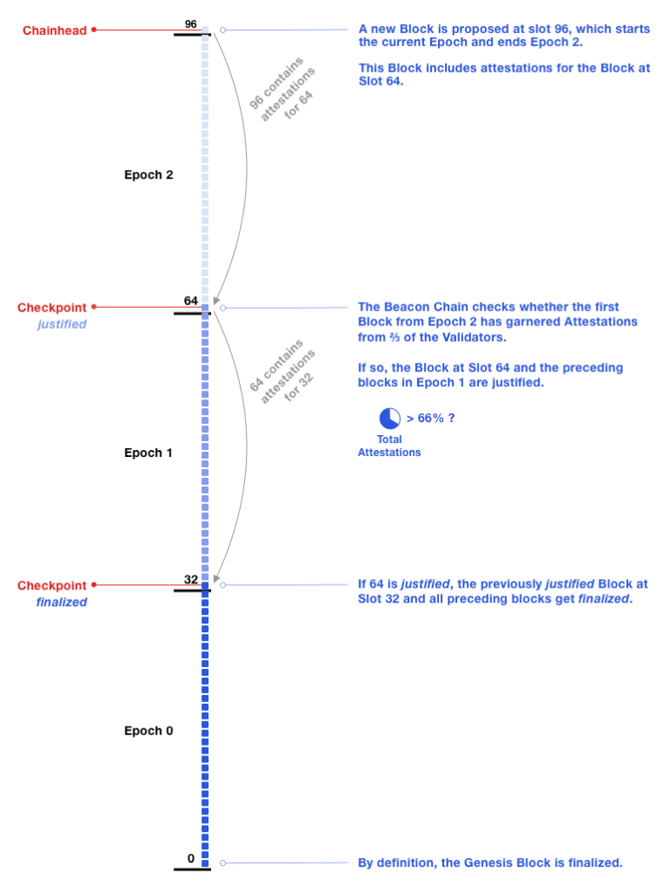
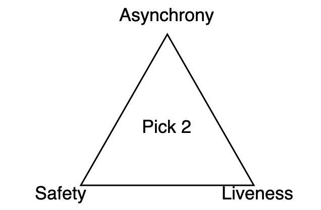

# ETH 2.0

ELI5 understanding of ETH 2.0 specs

**Safety**: gurantees that something bad never happen. Examples: Tendermint from Cosmos that uses BFT style consensus.

**Liveness**: something good eventually occurs. Example: POW, Casper used by Ethereum.

## **Why PoS**

An individual autonomy should always be greater than the power of any state. Cryptography solved this issue, by using ECC, individuals can now have a pair of keys that only he can access and thus, has the power to defend even state-level attacks.

Consensus in blockchain is what drives the value of the network, and from where the network derives its value. No attacker should have incentives to attack the network for his own gain. PoW style networks are based on rewards where a consensus participant has almost nothing to lose in case the network is attacked. PoS solves this problem by allocating stakes to network particpants and imposing penalties in case of any malicious actors in the system. The ratio of rewards v/s penalties determines the incentives of consensus participants to behave honestly as penalties are directly proportional to number of wrong validations, if more validators behave maliciously, then slashing is higher.

## Different types of PoS

- Chain-Based PoS: pseudo-random validator assigned at each time slot to create new block behind a previous block
- BFT-style PoS: (partially synchronous) randomly assigned validator proposes a block and canonical chain is assigned using a voting process on which each validator votes for the valid chain

## **Proof Of Stake**

- Stake ETH to become validator
  - For each 32 ETH staked, a validator is activated. Anyone can stake any number of ETHs and activate and control validators and execute **validator clients**.
  > Validator clients has the functionality of following and reading the Beacon Chain. A validator client can make calls into the Beacon nodes.
- Validator, responsible for adding blocks to the chain by verifying txs and policing blocks being added by other validators
  - Earns by successfully adding blocks
  - Staked eths slashed if illegal txs added
- Save Energy as selected randomly and not competing
- No need to mine, just validate blocks known as **Attesting**

## **Phases**

- Beacon Chain
- Sharding
- Execution

## **Sharding**

- Scaling nodes horizontally
- At least 128 Validators randomly assigned to a shard where a new block will be added in each slot of an epoch i.e., after 32 slots
- ETH plans for 64 shards

## **Beacon Chain**

- Main functioning body in the blockchain, managing all the shards and the validators
- Functions as heart of the chain
- Creates **committee**, which are the validators used to validate a blockchain on which everyone verifies, stores and downloads

## **Slots & Epochs**

- Chain is divided into **slots** and **epochs**
- **Slot** → timeframe to propose and validate a new block
  - In a time period pre-determined in a blockchain, 12 seconds in case of Ethereum, all shard blocks are added into the blockchain
  - Slots can be empty in case a validator fails to **propose** the block or the committee fails to attest
  - Genesis blocks added to both Beacon chain and shards at block 0
- **Epochs** → 32 slots comprises an epoch. > 12 sec * 32 slots = 6.4 mins

## **Crosslinks**

- reference to shard blocks
- basically the proof that a shard is valid
- created at beacon chain for every successful block proposed by a shard
- only after a crosslink does a validator get its reward

## **Committee**

- **Beacon chain** gets its name from the random numbers that it emits to the public
- uses RANDAO process to randomly select a group of validators for an epoch to a shard to attest transactions in a block
- crosslinks are made after attestation from validators of that slot
- Every epoch, validators randomnly assigned to a slot which is then subdivided into committees.
- Each committee is assigned a particular shard and they attempt to crosslink a shard block to Beacon chain head in order to gain rewards.
- 64 shards, each assigned 128 validators per committee -> Thus, has atleast 8192 validators

### **Beacon Chain Checkpoints**

A `checkpoint` or an `epoch boundary` is the first block in an epoch. If no such block, it is the most recent preceding block.

### Votes

- **`LMD GHOST`**: validator vote for beacon chain head, i.e. what they believe beacon chain head is.
- **`Casper FFG`**: When casting LMD GHOST vote, validators also vote for checkpoint in current epoch, called `target`. This also includes previous epoch checkpoint called `source`.

## Finality

> `Supermajority vote`: which is made by 2/3 of the total **balance** of all validators.

When an epoch checkpoint gets supermajority vote, it is said to be *justified*.
An epoch is *finalised* when it is justified and next epoch checkpoint gets justified.
When a epoch checkpoint, i.e. slot gets finalised, all preceding blocks also gets finalised.

- Finality is important as it gives gurantees to shards and ethereum parties regarding transactions.
- Reduces complexity with cross-shard communications.

## FLP Impossibility

In a distributed system, it is not possible to simultaneously have safetly, liveness and full asynchrony unless some unreasonable assumptions are made.

Ethereum uses both `LMD-GHOST` and `Casper FFG` as its protocol to justify and finalise blocks.

**LMD-GHOST** preferes liveness over safety in the form that validator can attest to a chain head and keep producing blocks while **Casper** prefers safety over liveness such that a block is finalised only when it is justified and in a later epoch, majority of validators attest it again to finalise it. Once, a block is finalised, it is added forever in the chain.

Due to **LMD-GHOST** prefering liveness over safety, there is a chance of reorgs. Capser FFG helps here as it prefers safety and decisions made under Casper is considered final. It has phases, in which nodes indicate they'd like to agree on something(justification), then agree that they've seen each other agreeing(finalisation).

## **Questions**

1. MEV in PoS
2. Reorgs

## **Checkpoints**

1. [https://ethereum.org/en/developers/docs/consensus-mechanisms/pos/](https://ethereum.org/en/developers/docs/consensus-mechanisms/pos/)
2. [eth2book.info](https://eth2book.info/altair/contents)
3. [https://github.com/ethereum/annotated-spec/blob/master/phase1/beacon-chain.md#introduction](https://github.com/ethereum/annotated-spec/blob/master/phase1/beacon-chain.md#introduction)
4. [https://ethos.dev/beacon-chain/](https://ethos.dev/beacon-chain/)
5. [https://ethresear.ch/t/two-ways-to-do-cross-links/2074](https://ethresear.ch/t/two-ways-to-do-cross-links/2074)
6. [https://vitalik.ca/general/2017/12/31/pos_faq.html](https://vitalik.ca/general/2017/12/31/pos_faq.html)
7. [https://medium.com/codechain/safety-and-liveness-blockchain-in-the-point-of-view-of-flp-impossibility-182e33927ce6](https://medium.com/codechain/safety-and-liveness-blockchain-in-the-point-of-view-of-flp-impossibility-182e33927ce6)
8. [https://medium.com/@VitalikButerin/a-proof-of-stake-design-philosophy-506585978d51](https://medium.com/@VitalikButerin/a-proof-of-stake-design-philosophy-506585978d51)
9. [Ben Eddington blog](https://hackmd.io/@benjaminion/eth2_news/https%3A%2F%2Fhackmd.io%2F%40benjaminion%2Fwnie2_220311)
10. [eth2book](https://eth2.incessant.ink/book/03__eth1/07__clients.html)
11. https://arxiv.org/pdf/2203.01315.pdf
12. [LMD GHOST and Casper FFG](https://blog.ethereum.org/2020/02/12/validated-staking-on-eth2-2-two-ghosts-in-a-trench-coat/)